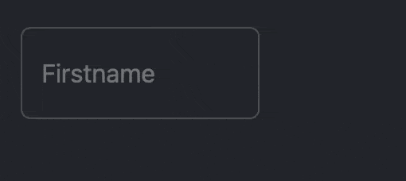

# Xojo Floating Label TextField and TextArea (Web 2.0)

A modern WebSDK-based custom control for [Xojo Web 2.0](https://www.xojo.com/products/web/) using native Bootstrap 5 floating labels.

## Features

- **Responsive:** Works with Bootstrap 5 floating labels  
  using native WebSDK technology.

- **Dark Mode:** Automatically adapts to user session appearance.

- **Compatibility:** Fully integrated into the Xojo IDE with property editor and layout preview.

- **Placeholder:** Uses a placeholder fallback to ensure proper Bootstrap behavior.

## Usage

1. Drag the `FloatingLabelTextField` / `FloatingLabelTextArea` class into your Xojo Web project.
2. Use it like a normal text field, bind events such as `TextChanged`.
3. Customize label and value via the `LabelText` and `Value` properties.

## Demo

## Requirements

- Xojo 2025r2 or later
- Web project using Bootstrap 5 (Xojo Web 2.0 default)

## License

MIT License — see [LICENSE](LICENSE) for details.

## Author

[FAESCH](https://github.com/FAESCH)
